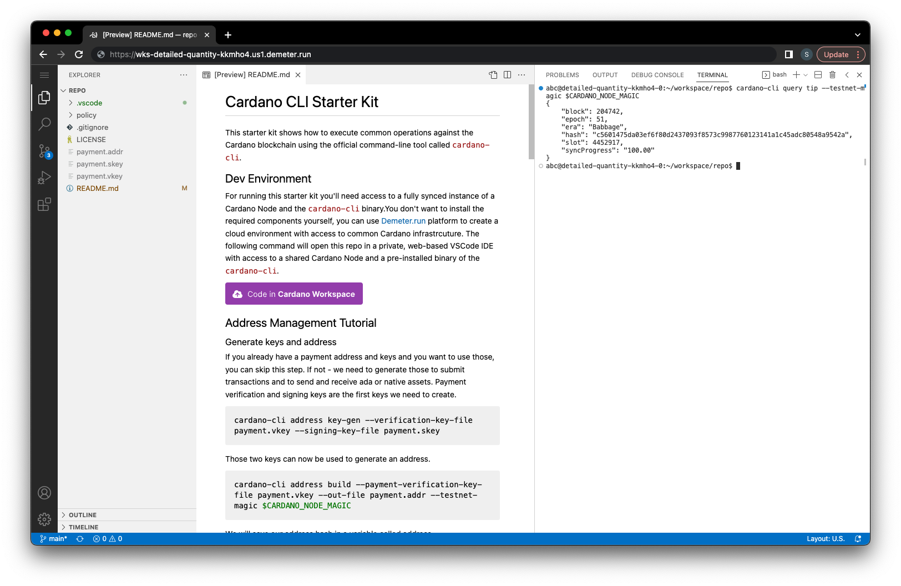

# Cardano CLI Starter Kit

This starter kit shows how to execute common operations against the Cardano blockchain using the official command-line tool called `cardano-cli`.

## Dev Environment

For running this starter kit you'll need access to a fully synced instance of a Cardano Node and the `cardano-cli` binary.

If you don't want to install the required components yourself, you can use the [Demeter.run](https://demeter.run) platform to create a cloud environment with access to common Cardano infrastructure. The following button will open this repo in a private, web-based VSCode IDE with access to a shared Cardano Node and a pre-installed binary of the `cardano-cli`.

[](https://demeter.run/code?repository=https://github.com/txpipe/cardano-cli-starter-kit.git&template=typescript)

## Navigating the Starter Kit

This starter kit includes an interactive Jupyter notebook tutorial (`TUTORIAL.ipynb`) that walks you through:
- Creating addresses and wallets
- Building and submitting transactions
- Minting native assets (tokens)

Open `TUTORIAL.ipynb` in VSCode to get started with the step-by-step guide.

### Screen Layout

We recommend splitting your editor into two panes: the tutorial notebook on the left and a terminal on the right.



You can execute the code cells directly in the notebook, or copy commands into the terminal for immediate feedback.

### Cardano Node Access

Since you're running this starter kit from a _Cardano Workspace_, you already have access to the required infrastructure, such as the Cardano Node. All the required binaries are pre-installed by default, including the `cardano-cli`.

The network you're connected to (mainnet, preview, preprod, etc) is defined by your project's configuration, selected when creating your environment.

To simplify the process, _Cardano Workspaces_ come pre-configured with environment variables that allow you to connect to the node without extra steps. These are the variables relevant for this tutorial:

- `CARDANO_NODE_SOCKET_PATH`: the location of the unix socket where the Cardano node is listening
- `CARDANO_NODE_MAGIC`: the network magic corresponding to the connected node

To verify your connection to the node, run the following command to query the current tip:

```sh
cardano-cli query tip --testnet-magic $CARDANO_NODE_MAGIC
```

If everything works correctly, you should see output similar to this:

```json
{
    "block": 4045465,
    "epoch": 248,
    "era": "Conway",
    "hash": "f21698559c893bdd86a3e0b237515cef01c1b2283f16fc205bfe370e4b69feed",
    "slot": 105641870,
    "slotInEpoch": 147470,
    "slotsToEpochEnd": 284530,
    "syncProgress": "100.00"
}
```
